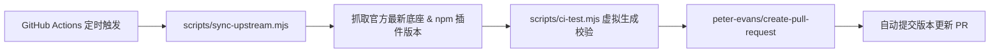

# @zhiwu215/code-template

> 现代化多生态前端项目脚手架与模板开发工具。  
> 借鉴 Vue 3 官方（`create-vue`）的**模块化切片架构**设计，支持按需自由选择框架、样式库、组件库与状态管理方案，并基于 GitHub Actions 实现上游依赖全自动对齐。

---

## 快速使用

无需手动 clone 仓库，已发布至 npm，在终端中直接通过一行命令即可快速启动交互式项目创建：

```bash
# 使用 npx (推荐，始终拉取最新脚手架)
npx @zhiwu215/code-template

# 或使用 pnpm dlx
pnpm dlx @zhiwu215/code-template

# 或使用 yarn
yarn dlx @zhiwu215/code-template
```

### 交互流程

1. **项目名称**：输入自定义项目目录名（默认 `my-app`）
2. **生态体系**：选择目标开发平台（如 `Electron 桌面应用 (基于 electron-vite)`）
3. **核心框架**：选择视图框架（如 `React + TypeScript`）
4. **CSS 方案**：选择样式系统（如 `Tailwind CSS (v4)` / 原生 CSS）
5. **UI 组件库**：选择组件库（如 `shadcn/ui` / 无）
6. **状态管理**：选择状态方案（如 `Zustand` / 无）

创建完成后，终端会输出进入目录和启动项目的指引：

```bash
cd my-app
pnpm install
pnpm dev
```

---

## 核心设计原理

### 1. 传统模板痛点 vs 模块化切片架构

在传统模板仓库中，如果想要支持多种技术栈搭配（如 React + Tailwind、React + Shadcn、React + Zustand 等），通常有两类做法：
- **方案 A（多分支/多仓库）**：维护 `template-react-base`、`template-react-tailwind` 等数十个分支。这种方式维护成本极高，任何一个底座小改动都要同步十几个分支。
- **方案 B（全家桶模式）**：模板中塞满所有库，不需要的由用户手动删。这会导致初始模板极其臃肿，上手成本高。

**本项目借鉴了 Vue 3 官方脚手架（`create-vue`）的核心架构理念**：
将项目拆解为 **「纯净最小底座（Base）」** 与 **「功能特性切片（Plugins）」**，在用户选择完成后动态组装渲染。

```
templates/
  └── electron-vite/
        ├── react/                 # 1. 纯净底座（Base）
        │     ├── package.json     #    基础依赖与构建脚本
        │     ├── electron.vite.config.ts
        │     └── src/
        └── plugins/               # 2. 独立功能切片（Plugins）
              ├── tailwind/        #    Tailwind v4 配置与样式入口
              ├── shadcn/          #    shadcn components.json、lib/utils.ts
              └── zustand/         #    Zustand 示例与基础 store
```

### 2. 模板渲染引擎（`renderTemplate`）

在 `src/utils/renderTemplate.js` 中实现了轻量且强大的递归装配引擎：

1. **文件目录叠加（Folder Overlay）**：
   - 首先将选定的 Base 底座完整拷贝到目标路径。
   - 依次扫描用户勾选的 Plugin 目录，将插件内的文件递归叠加覆盖到底座目录中。
2. **`package.json` 智能深度合并（Deep Merge）**：
   - 遇到 `package.json` 时不进行简单覆盖，而是调用 `deepMerge`。
   - 智能合并 `dependencies` 与 `devDependencies`，并对同名字段与数组配置项去重融合。
3. **文件特殊映射机制**：
   - 解决 npm 发布时会自动忽略或重命名 `.gitignore` 的固有缺陷，模板源码中使用 `_gitignore` 命名，在渲染引擎生成时自动还原映射为 `.gitignore`。
4. **依赖依赖拓扑拓扑关系补全**：
   - 例如用户选择了 `shadcn/ui` 时，脚手架会自动推导并注入其强依赖的 `Tailwind CSS` 切片，保证生成的项目开箱即用。

---

## 依赖版本自动化与“防焦虑”机制

为了兼顾**开箱离线秒级创建**与**长期依赖版本不掉队**，项目构建了一套自动同步流水线：



1. **模板版本静态锁定**：所有模板切片均使用明确且经过兼容性测试的语义化版本号，不盲目使用 `latest`，避免上游突发破坏性升级导致项目崩溃。
2. **定时自动对齐**：通过 `.github/workflows/sync-upstream.yml` 每周自动拉取官方最新底座（如 `@quick-start/create-electron`）及相关生态插件（Tailwind、shadcn、Zustand 等）的最新发布版本。
3. **全链路 CI 虚拟合成验证**：在合并更新前，CI 自动执行测试脚本，模拟生成全插件挂载的完整应用并校验完整性。
4. **PR 审核合入**：一旦检测到有版本升级，GitHub Actions 会自动开出带有更新明细的 Pull Request，审核无误后一键合并发版。

---

## 目录结构说明

```bash
code-template/
├── .github/workflows/     # GitHub Actions 自动化工作流
│   └── sync-upstream.yml  # 依赖版本自动对齐并提 PR 工作流
├── scripts/
│   ├── ci-test.mjs        # CI 虚拟全链路渲染与依赖校验
│   └── sync-upstream.mjs  # 依赖版本探测与模板同步脚本
├── src/
│   ├── frameworks/        # 各技术生态的选项交互与组装逻辑
│   │   └── electron-vite.js
│   └── utils/             # 核心工具库
│       └── renderTemplate.js # 模板文件递归渲染与 deepMerge 引擎
├── templates/             # 模板库（底座与插件切片）
│   └── electron-vite/
│       ├── react/         # React + TS 底座
│       └── plugins/       # tailwind / shadcn / zustand 插件
├── index.js               # CLI 交互总入口
└── package.json
```

---

## License

[MIT](LICENSE)
